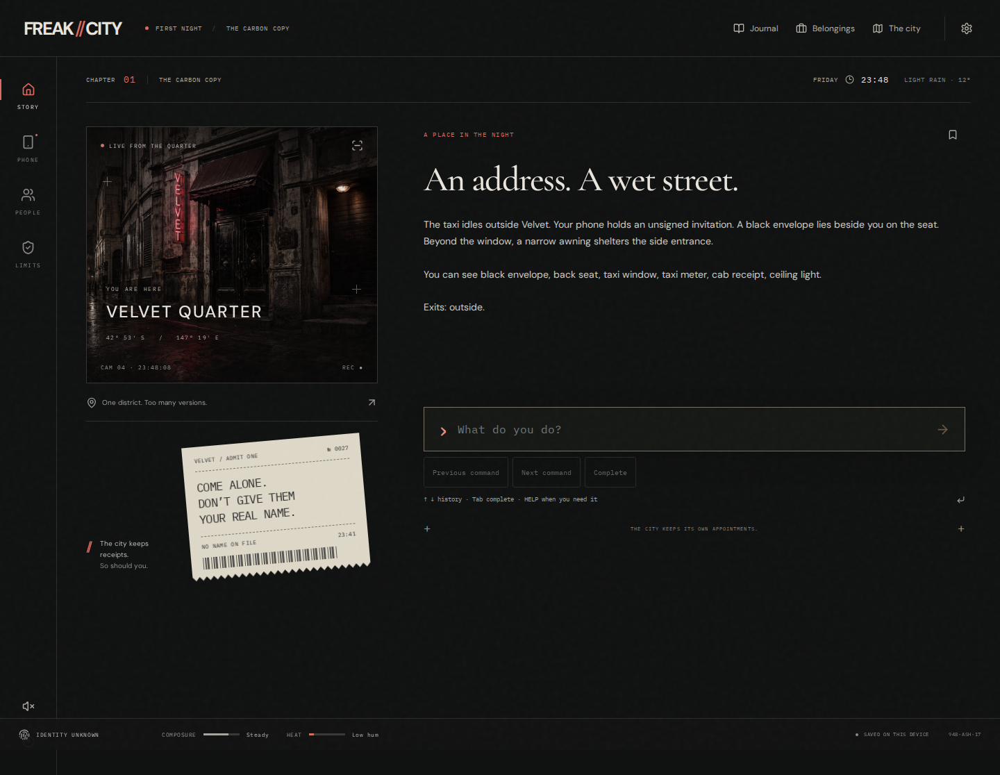
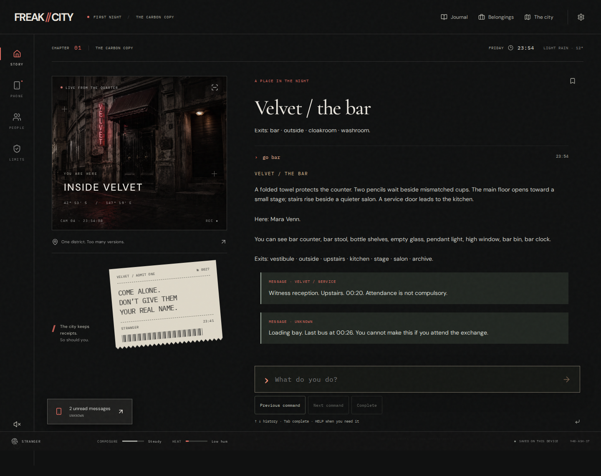
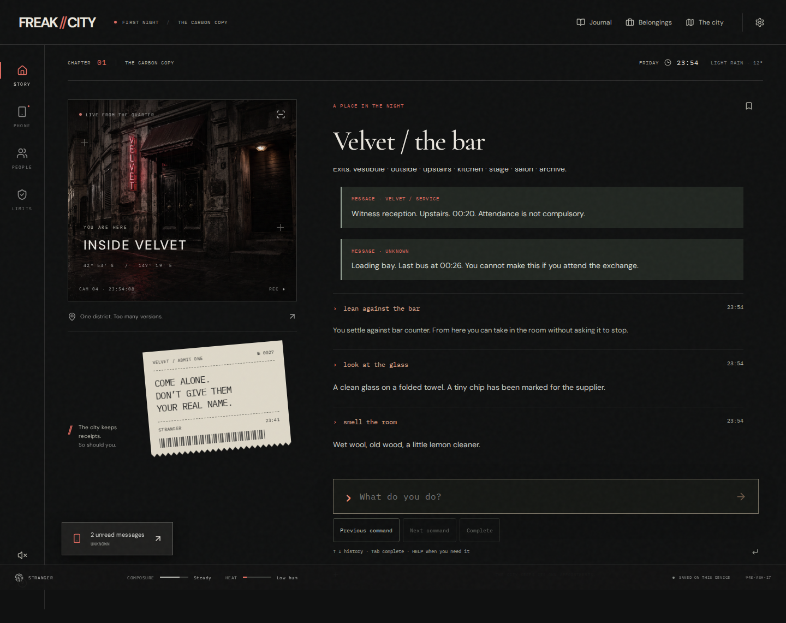
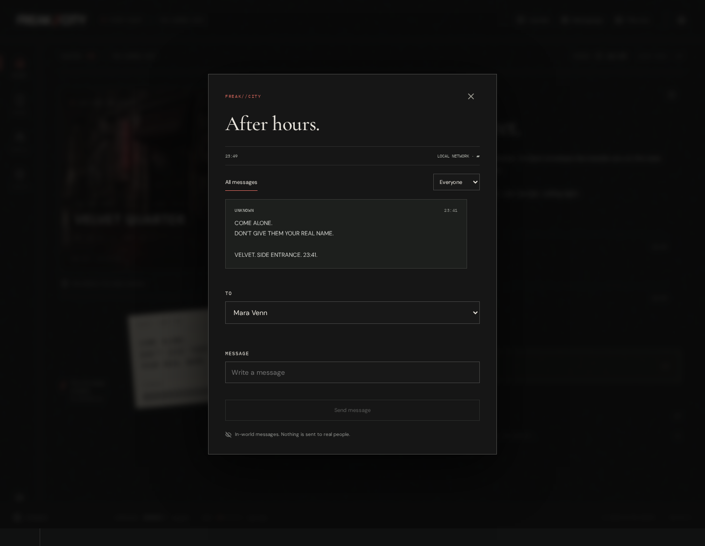
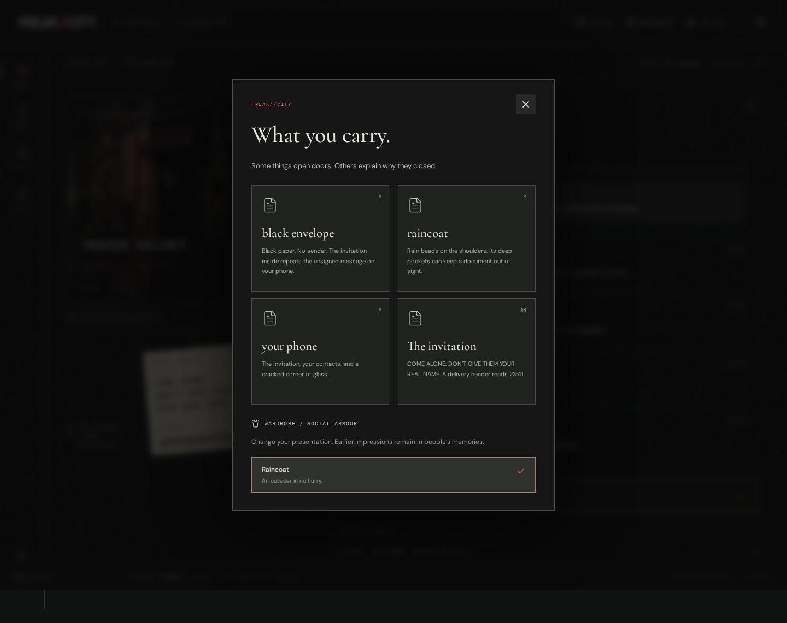
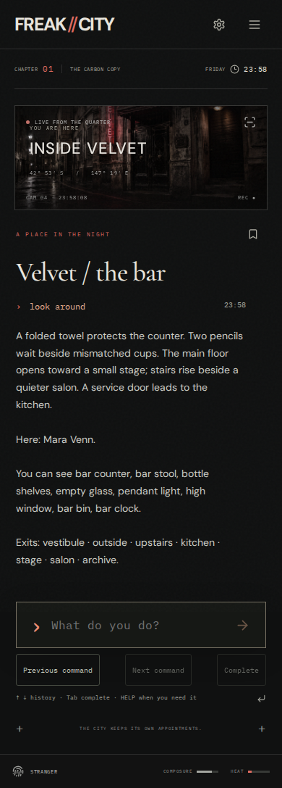

# FREAK//CITY

> **PRE-ALPHA / ACTIVE DEVELOPMENT**
>
> The current browser snapshot is a **PRE-ALPHA HUMAN PLAYTEST BUILD**.
>
> This is an early parser, narrative-simulation and interaction prototype.
> The UI, story, adult tone, parser, art, systems and scope are all expected to change substantially. This is not a finished game, beta, release candidate or promise of the final product.

**[PLAY NOW →](https://astrobyte-dev.github.io/freak-city/)** · **[First-play instructions](PLAYTEST.md)** · **[Report a parser problem](https://github.com/astrobyte-dev/freak-city/issues/new?template=parser-bug.yml)**



An invitation. A borrowed name. A city that keeps receipts.

FREAK//CITY is an adults-only neo-noir interactive-fiction RPG built around a modern parser, persistent locations, NPC memory, misinformation, relationships and scheduled events. The evening continues while you decide where to spend your attention.

**Development happens in public in this repository.** Source, full history, checkpoints, tests, architecture notes, design documents and debug tooling are available here. **Spoiler note:** source, `docs/`, tests and generated QA artifacts reveal story structure, hidden conditions and solutions. Play once before exploring them if you want a blind first experience. **Build: 0.1.0-playtest.1**. Find the same identifier in Settings when reporting a problem.

## One night, in your own words

Type what you want to try. You do not need to learn a command dictionary first:

```text
look around
ask Mara about the envelope
check my phone
listen at the door
```

`HELP` explains how to communicate with the game. `HINT` offers a little guidance when requested. The parser is authored and deterministic; it will sometimes misunderstand you. Those moments are especially useful feedback.



<details>
<summary>A few more views of this build — no solution spoilers</summary>





</details>

## What this playtest is for

We are testing whether natural commands are understood, locations feel responsive, conversations make sense, people seem to have their own lives, and time and consequences are understandable. We also want to hear where the reading, phone interface or mobile input becomes tiring or confusing. Stopping early is useful feedback.

**Please play once before reading development information or other players' reports.** Follow [PLAYTEST.md](PLAYTEST.md) after your first attempt. There is no need to explore every route or find every feature.

## Adults 18+

FREAK//CITY is intended for adults aged 18+. It contains mature adult themes, kink/fetish culture, sexual tension, strong language and morally complicated situations. This prototype does not contain graphic sexual scenes. Adulthood confirmation and content-boundary controls are available in the game; audio starts only if you enable it.

## Browser and device notes

Use a current desktop or mobile browser with JavaScript and local storage enabled. Chromium is the primary automated test target; reports from Safari, Firefox and real phones are welcome. No installation or account is needed. On a phone, history and completion controls edit the words you type; they do not choose your actions.



## Privacy and feedback

There are **no game accounts, analytics, external model calls or preference transmissions**. Saves remain in your browser. Unsent drafts stay in the current browser tab's session storage, including reloads. Delete local game data in Settings clears the game's stored state and drafts. GitHub hosts the files and public issue tracker and handles web requests under its own privacy policy.

**Exported saves contain private game state and preferences. Do not upload them to public issues.** Do not post sensitive personal adult preferences publicly. If you want to discuss adult-theme reactions or private feedback, contact the developer through the private channel by which you received the playtest invitation.

For a parser problem, [open a bug report](https://github.com/astrobyte-dev/freak-city/issues/new?template=parser-bug.yml) with the build, device/browser, location, exact command, expected result and actual result. Check screenshots for personal information and spoilers before attaching them. Keep public issue titles spoiler-free.

No open-source licence has been assigned to the original game, story or artwork. Third-party component and font notices are included in [THIRD_PARTY_NOTICES.md](THIRD_PARTY_NOTICES.md). The current artwork is generated environment art; no image or model service runs during play.

## Run the development build

Use Node.js 22 LTS (see `.nvmrc`) and npm:

```sh
git clone https://github.com/astrobyte-dev/freak-city.git
cd freak-city
npm ci
npm run dev
```

Open the local URL printed by Vite. The dev build includes the inspector (**Ctrl+Shift+D**); it exposes spoilers and can create non-canonical states. The public Pages build uses production assets and keeps the inspector out of the normal player interface. Its implementation remains in the public source.

```sh
npm run check          # build, unit/regression tests, narrative QA and command campaigns
npm run format:check
npx playwright install chromium
npm run test:browser   # with the local dev server running; PLAYTEST_URL overrides its URL
npm run build:playtest # production assets for the /freak-city/ Pages path
npm run preview:playtest # preview that same subpath locally
```

## Ideas, feedback and contributions

Constructive feedback and ideas are welcome. Your friend does not need to know the codebase to point out a confusing interaction or suggest a better one. Describe the experience you wanted, give a concrete example, and separate a bug from a proposed change. Use [issues](https://github.com/astrobyte-dev/freak-city/issues) for public feedback and [CONTRIBUTING.md](CONTRIBUTING.md) for development guidance. Please discuss substantial changes before investing in a large pull request.

Spoiler-labelled development starting points:

- [Architecture and consequence propagation](docs/ARCHITECTURE.md)
- [Parser design and authoring](docs/PARSER-PIVOT.md)
- [Interaction pass and parser gap reports](docs/INTERACTION-PASS.md)
- [Narrative authoring](docs/AUTHORING.md)
- [Story bible — major spoilers](docs/STORY-BIBLE.md)
- [Character bible — major spoilers](docs/CHARACTERS.md)
- [QA and known limitations](docs/QA-AND-LIMITATIONS.md)
- [Asset provenance](docs/ASSETS.md)

The original parser checkpoint is tagged `parser-pivot-checkpoint`; this human-playtest snapshot is tagged `v0.1.0-playtest.1`. GitHub Actions builds and deploys Pages from `main`. The history is preserved without squashing.
