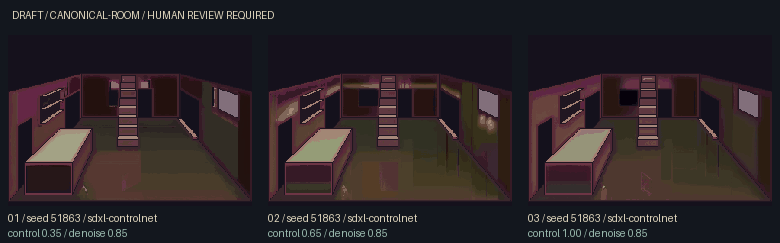
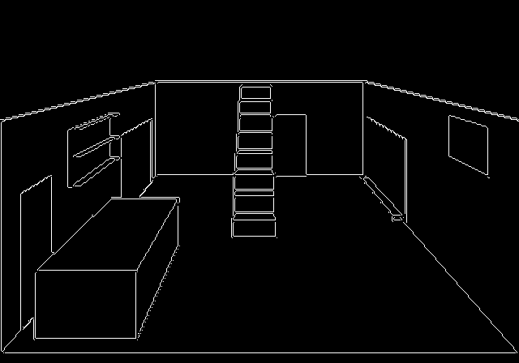
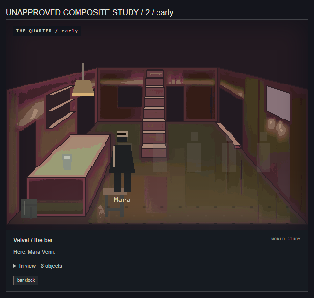

# Velvet structural SDXL bake-off

> Historical experiment, preserved. The current user-approved next direction is external / ChatGPT hero-room editing, documented in [WORKSTATION-HANDOFF.md](WORKSTATION-HANDOFF.md). The later Kontext proposal in this report is deferred; do not download another model family.

**Result: C — still insufficient for production canonical rooms.** Three real SDXL Base + small Canny ControlNet candidates were generated on the RTX 4070. All preserve the protected blockout pixels, but material rendering remains crude and editable walls acquire false recesses/window-like shapes. No candidate is approved or promoted. This is an assessment of this bounded configuration, not all possible SDXL checkpoints.

## Scope and preserved work

Continue `feature/state-driven-visuals`, with PR #1 draft. This pass adds a separate production backend, control provenance, comparison/review tooling, tests and art planning. Gameplay, story, parser, relationships, THE PULL, central mystery, main and the public Pages build are unchanged. No shipping asset registry or canonical image changed. The original collaborator package remains preserved.

Turbo's texture, text-only room, whole-image guided room, regional room and cinematic experiments remain under their original run IDs. All 26 original candidate PNGs were checked against their sidecar hashes. The Turbo scene preset and strongest scene direction, candidate 02 from `cf0d1dd767d8`, are unchanged and unpromoted. No new Turbo batch, other room, portrait or sprite library was generated.

## Exact models, licence and setup

| Component                                                  | Source and pinned revision                                                               | Selected FP16 weights |
| ---------------------------------------------------------- | ---------------------------------------------------------------------------------------- | --------------------: |
| Production base                                            | `stabilityai/stable-diffusion-xl-base-1.0` / `462165984030d82259a11f4367a4eed129e94a7b`  |   6,938,011,430 bytes |
| Canny control                                              | `diffusers/controlnet-canny-sdxl-1.0-small` / `edd85f64c5f87dfb6d73762949d9daca16389518` |     320,237,179 bytes |
| Total weights                                              | FP16 safetensors only                                                                    |   7,258,248,609 bytes |
| Selected files, including configs/tokenizers/licence/cards | Exact inventory in `tools/visual-gen/controlnet-models.json`                             |   7,261,453,271 bytes |

SDXL Base is a documented baseline with an official Diffusers architecture and a useful environment-generation capability to compare against Turbo. Its base checkpoint can operate without a refiner. The selected ControlNet is published by Diffusers, trained for SDXL Base, and much smaller than the full ControlNet. Its model card explicitly calls it experimental and notes that complex conditioning can favour larger versions; this quality limitation is part of the experiment. [SDXL Base model card](https://huggingface.co/stabilityai/stable-diffusion-xl-base-1.0), [small Canny model card](https://huggingface.co/diffusers/controlnet-canny-sdxl-1.0-small).

The base uses **CreativeML Open RAIL++-M, dated July 26, 2023**. The small Canny repository declares **Open RAIL++** and names SDXL Base as its base model. These terms permit potential commercial asset use subject to their conditions and use restrictions; the base licence says the licensor does not claim rights in generated output, while responsibility for output/use remains with the user. This is the reason these weights were suitable for this evaluation, not blanket clearance for a future game release or every generated image. Licence/model cards were retained in the pinned cache. No claim is made that an arbitrary fine-tune inherits identical terms. [Base licence](https://huggingface.co/stabilityai/stable-diffusion-xl-base-1.0/blob/462165984030d82259a11f4367a4eed129e94a7b/LICENSE.md), [control licence declaration](https://huggingface.co/diffusers/controlnet-canny-sdxl-1.0-small/blob/edd85f64c5f87dfb6d73762949d9daca16389518/README.md).

Exact download sizes and the explicit offload plan were reported before downloading, following the user's authorization for the smallest sensible SDXL structural experiment. The selected payload was uncached and downloaded in **134.859 seconds**. These are file payload bytes, not measured wire traffic including HTTP overhead or cache deduplication. `HF_HOME` remains `C:\Users\thr3e\.cache\huggingface`; no new cache location or system Python/Node replacement was needed. About 289.5 GiB was free before download.

The existing `.venv` remains Python 3.10.11, Torch 2.11.0+cu128, CUDA runtime 12.8, Diffusers 0.39.0, Transformers 4.57.6 and Accelerate 1.14.0. Driver 610.47 supports the installed Torch runtime. The only additional Python package was **opencv-python-headless 4.11.0.86**, for deterministic Canny; the existing NumPy dependency was reused. Exact environment lock: `.visuals/setup/requirements-controlnet-lock.txt`. Node remains the project's portable 22.23.2. Roughly 7.26 GB of selected model files plus the small OpenCV installation are the setup impact; models remain outside git and the browser.

Before inference, the working estimate was roughly 6–8 GiB of allocated VRAM with batch-one model offload at this resolution; it was explicitly an estimate. Actual results below replace it. Host RAM is 32 GB. The backend uses **CUDA FP16 inference with explicit model CPU offload**, which stages components in host RAM between GPU use. CUDA unavailability and GPU OOM fail clearly; there is no CPU generation fallback or automatic parameter change. Diffusers documents these memory techniques. [Memory/offload guide](https://huggingface.co/docs/diffusers/optimization/memory).

## Structural input and controlled variables

The source is the **unchanged existing** `docs/visuals/velvet-bar-layout/layout.json` and its 640 × 448 blockout. Its blueprint remains `src/content/visuals/layouts/bar.json`. This is pending human layout approval, not newly approved geography. Existing front cutaway/off-camera routes and nonmetric art-coordinate assumptions remain explicit.

Canny: RGB → grayscale; thresholds **20 / 40**; aperture 3; `L2gradient=False`; no resize, crop or learned annotator. The conventional 100/200 preview missed low-contrast wall/opening boundaries, so it was rejected before any model run. The inspected 20/40 map includes one stair with treads, counter footprint, shelves, high window, visible openings, envelope and the stage edge. Off-camera routes remain documented in the layout/facts rather than being invented in the image. Dynamic props and people are absent from the control.

Depth was considered but not generated. The existing renderer supplies a projected nonmetric blockout, not a calibrated depth pass; a guessed grayscale depth map would add uncertain geometry and another checkpoint. Canny is the smallest deterministic control for this first experiment. ControlNet + inpainting is implemented using Diffusers' `StableDiffusionXLControlNetInpaintPipeline`, supported for an SDXL base model with a four-channel UNet. [Official ControlNet/inpainting guide](https://huggingface.co/docs/diffusers/using-diffusers/controlnet).

The five existing masks—walls, floor, counter, shelves and stairs—are retained byte-for-byte in each batch. Their union defines **one global inpaint pass per candidate**, allowing coherent surface lighting while retaining regional provenance. Protected openings, window glass, stage relationship and polygon contours remain outside editable interiors. Hard mask restoration follows inference, then protected palette restoration follows pixel crunch. The original model output is also retained before those restorations.

| Variable                  | Fixed setting                                                              |
| ------------------------- | -------------------------------------------------------------------------- |
| Room / role / variant     | Velvet / canonical-room / canonical                                        |
| Base seed                 | **51863**, identical for all three                                         |
| Denoising                 | **0.85**                                                                   |
| Steps                     | 30 requested, **25 effective**                                             |
| Classifier-free guidance  | **5.0**, including a real negative prompt                                  |
| Control guidance schedule | Start 0, end 1                                                             |
| Source                    | 640 × 448                                                                  |
| Pixel / display           | **320 × 224 → 640 × 448**, exact nearest-neighbour 2×                      |
| Palette / contrast        | 48 colours maximum / 1.15                                                  |
| Scheduler                 | EulerDiscreteScheduler, leading timestep spacing                           |
| VAE                       | Original base VAE, native float32 upcast, tiling enabled; no alternate VAE |
| Only matrix variable      | `controlnet_conditioning_scale`: **0.35 / 0.65 / 1.0**                     |

The fixed 66-token production prompt asks for restrained PS1 pixel texture, magenta ambient light, cyan contrast, black shadows, worn plaster/dark wood, reflective floor, exactly the existing fixed fixtures and open space for sprites. The negative prompt rejects people, loose props, text/logos, extra stairs/doors and galleries. Both CLIP tokenizers were checked: 66 positive / 39 negative tokens, without truncation. Full strings and settings are in [measurements](visuals/controlnet-bakeoff/measurements.json) and every original sidecar. The successful Turbo scene prompt is not reused or edited.

## Measurements and visual findings

All three images completed in one offline-loaded process: **24.223 seconds** including model initialization, inference, crunch, sidecars and contact sheet. Individual inference timings include the pipeline's encode/denoise/decode and component transfers; the first includes initial warm-up effects. These are one-run observations, not repeated performance benchmarks.

| Candidate / control | Inference | PNG bytes | Lossless 640 WebP bytes | Art assessment                                                                                                                          |
| ------------------- | --------: | --------: | ----------------------: | --------------------------------------------------------------------------------------------------------------------------------------- |
| 01 / LOW 0.35       |   7.925 s |    13,831 |                   5,450 | Large false back-wall panel/recess shapes and thin luminous trim by the window; olive/brown floor and weak material detail              |
| 02 / MEDIUM 0.65    |   5.851 s |    16,801 |                   6,752 | More light variation; false dark window-like square left of stair, light-like marks below real high window, streak/leg-like floor marks |
| 03 / HIGH 1.0       |   5.629 s |    14,426 |                   5,876 | False square/panels persist; blocky reflections and flat surfaces; stronger control does not solve semantics                            |

Peak Torch allocated memory: **5,673.5 MiB**. Peak reserved memory: **5,910 MiB**. These are process CUDA allocator peaks, not total desktop GPU consumption. All candidates used the pinned production model and control model on the actual RTX 4070. No load/download/generation fallback occurred. Diffusers emitted VAE upcast notices; the base VAE completed and outputs were visually inspected.

All three have **zero changed protected pixels** at both restored source and 320-master scales. This proves the mask/restoration guard, not that ControlNet alone preserved geometry. The staircase/counter/window silhouettes and envelope mechanically survive, and no second stair is added. However, wall-interior patterns imply extra architectural features, the stage remains a crude narrow cue, and the atmosphere does not approach the successful expressive scene lane. The pre-restoration model output is similarly weak, so palette crunch is not the sole cause.

This is **C**, not B: getting these plates to the target would require substantial material repainting and semantic cleanup rather than a few bounded corrections. Do not select a “winner” for promotion merely because one preserves pixels or has more highlights.

The actual `LocationVisual` composites include the current state-driven NPC/prop layers, plus early/late/dawn and mobile snapshots. They demonstrate binding and expose the schematic overlay mismatch. They use clearly labelled unapproved in-memory test bindings; no registry, saved game or canonical file is written. The future [dynamic overlay art plan](DYNAMIC-OVERLAY-ART-PLAN.md) specifies master-grid sizing, contact anchors, stable named identities, palettes, variants and occlusion. No full sprite library is implemented here.

## Review files and reproduction

Repository root on this machine: `C:\Users\thr3e\OneDrive\Desktop\Projects\freak-city`.

- Review page: `.visuals/generated/bar/review/319346d00a51/index.html`
- Contact sheet: `.visuals/generated/bar/review/319346d00a51/contact-sheet.webp`
- Candidates and original sidecars: `.visuals/generated/bar/raw/319346d00a51/bar__canonical-room__canonical__candidate-01.png` through `candidate-03.png`, each with matching `.json`.
- Batch subfolders: `reference/`, `control/`, `masks/`, `model-output/`, `sources/`, `pixels/`.
- Review subfolder: `runtime-01.png` through `runtime-03.png`, `runtime-01-late.png`, `runtime-01-dawn.png`, `runtime-01-mobile.png`, `runtime-composite.json`, `optimized/`, `measurements.json`, `review-findings.json`, `review-browser.json` and `review-page.png`.
- Portable evidence committed for GitHub review: `docs/visuals/controlnet-bakeoff/`. It contains candidates, contact/control, representative composite, full review screenshot, metrics and findings; these are documentation, not shipping assets.

The [integrated pipeline guide](GENERATIVE-ASSET-PIPELINE.md#sdxl-controlnet-canonical-bake-off) has the exact download/generation command. Existing run IDs refuse overwrite. The page puts reference, control, candidate, runtime composite, facts and settings together; all 28 referenced images loaded in browser testing, with no page errors or desktop/mobile overflow. [Review screenshot](visuals/controlnet-bakeoff/review-page.png).

## Validation and escalation

The full `npm run check` passed before generation: build, 1,000 JS tests, narrative QA, playtest/content checks, 12 scripted parser campaigns, 60 natural-language campaigns and all 117 scenes in the embodiment audit. The existing motel conditional-exit review flag is unchanged. Python now has **48 passing tests**, including registration, no-CUDA failure, cached pinned loading, control provenance, fixed-seed/denoise matrix, real pipeline arguments, metadata, reference/control/mask tamper rejection, review attestation and manual-edit provenance. CPU/dry-run tests do not load model weights. Additional normal/Pages build, formatting and asset checks complete the branch validation.

Recommend **one next family: FLUX.1 Kontext image editing/refinement**, subject to explicit separate authorization. Its supplied-image/text-edit objective makes it a reasonable hypothesis for material/lighting refinement of the same fixed room; it is not a geometry guarantee. No Kontext or Qwen weights were downloaded or tested. [Official Kontext model card](https://huggingface.co/black-forest-labs/FLUX.1-Kontext-dev).

Hardware estimate, not a local benchmark: Kontext's 12-billion-parameter transformer alone needs roughly 24 GB at two bytes per weight, before text encoders and activations. A stock full-precision pipeline will not fit the 12 GB GPU. A future local trial would need a reviewed 4-bit transformer/text-encoder strategy and explicit component/block offload; allow roughly 8–12 GB active VRAM as an unverified target, expect slower inference, and prefer 64 GB host RAM for loading headroom over this machine's currently shared 32 GB. A 24 GB GPU still benefits from offloading encoders. Verify the exact quantization backend's Windows support and payload sizes before authorizing a download. [Diffusers Flux quantization](https://huggingface.co/docs/diffusers/main/api/pipelines/flux), [memory/offload guidance](https://huggingface.co/docs/diffusers/optimization/memory).

Kontext dev's **non-commercial model licence** is a separate issue from its output permissions: commercial outputs are allowed subject to terms, but commercial model operation may need a separate licence. A future production evaluation must settle the intended use and exact weights/licence first; it must not silently become a game-production backend. [Official Kontext licence](https://huggingface.co/black-forest-labs/FLUX.1-Kontext-dev/blob/main/LICENSE.md).
