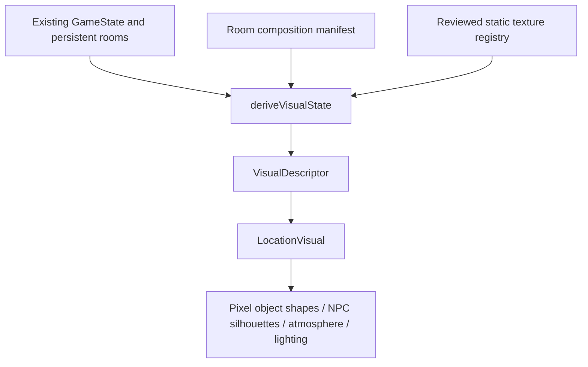

# Visual world architecture

**PRE-ALPHA / ACTIVE DEVELOPMENT · development spoilers.** This feature lives on `feature/state-driven-visuals`; `main` and its blind human-playtest deployment remain the reference build. `pre-state-driven-visuals` preserves the public starting point.

## One simulation, another view

`src/visuals/derive.ts` is a read-only projection of an initialized parser world. It calls the parser's existing `isVisible`, `isCarried` and `presentNPCs` functions. It does not maintain a second inventory, move NPCs, advance time or change a save. Old saves need no visual-state migration. The renderer receives plain data and has no command callbacks or hotspots.

The descriptor exposes room/location, time band, authored rain, lighting, decorative crowd level, atmosphere, NPC presence, canonical objects, evidence, doors, containers, open states, damage, authored workplace activity, variant, selected base and overlays. An object includes its real ID, name and parser aliases. Objects in inventory or on a person are omitted from the room object layer; named people are represented separately. Closed or invisible ancestors and destroyed objects follow parser visibility. A moved object loses its original spatial anchor and appears in the textual object register at its actual visible destination.

All 17 existing rooms have composition manifests in `src/content/visuals/manifest.ts`. They inherit identity and geography from `spaces.ts`. Four have authored pixel studies: **street (Velvet exterior), bar, loading-bay and apartment**. Remaining rooms have abstract texture studies, named silhouettes and a textual object register. They deliberately do not invent recognizable room architecture. This is prototype art, not full-world art coverage.

## Composition and truth

The compositor uses inline SVG integer-coordinate shapes plus CSS. Its 320 × 224 reference frame preserves crisp pixels; normal HTML typography stays readable. Layers are texture/background, canonical object shapes, anonymous atmosphere, named NPC silhouettes, reflection, lighting and display texture. Solid canonical wall shapes render before objects attached in front of them. The viewport has a reserved aspect ratio, so loading and room changes do not shift the page.

Anchors define composition, not additional geography or action targets. A door shape requires a visible Door entity; its opening follows that entity. Windows, lights, shelves and furnishings require their corresponding existing affordance entities. Unsupported objects get their real names in a compact register instead of a guessed picture. The expanded **In view** section exposes all depicted entity names and states in text even with images disabled. No necessary fact exists only in the image. The ordinary room narration remains intact.

Generated raster assets are **empty material/lighting plates only in this version**. They cannot bake in props, doors, windows, faces, evidence, crowds or damage. These facts belong to removable runtime layers. Prompting a model to obey a floor plan is insufficient to guarantee consistency. Future architecture plates or per-object sprites need an explicit state/occlusion contract and new review checks first.

## Time, weather, boundaries and events

The existing minute clock selects early (19:00–23:59), night (00:00–01:59), late (02:00–03:59), closing (04:00–04:59), dawn (05:00–06:59) or day. These are art-direction bands, not new venue opening rules. They change a colour wash and, at the bar, anonymous decorative density. They do not turn off a canonical light, displace a chair or dirty an intact object based on a guessed schedule.

The authored night is rainy; there is no weather simulation. Normal visuals never decide that rain has stopped. Exterior rain and reflections require an exterior/sheltered manifest. Interior rooms do not get rain across their walls. Existing workplace activity is exposed as text. No unmodelled crate is invented to illustrate a prose change.

NPC placement uses actual scheduled location, including off-duty departure. Anonymous faint figures are noninteractive atmosphere permitted by the visual brief; they cannot stand in for Mara or Luca. Silhouettes and plates contain no sexual activity or thematic material requiring a new boundary interpretation. The old fake CCTV camera framing has been removed; the real loading-bay camera remains a canonical object regardless of the player's surveillance-text preference.

## Settings, performance and accessibility

Environmental visuals has **On / Reduced / Off** in Settings. Reduced removes rain, grain and haze animation while retaining a still world view. Off mounts no image or SVG. The preference is local presentation data, separate from saves, and is cleared by Delete local game data. Reduced-motion preference, hidden browser tabs and offscreen viewports stop ambient animation. Narrow screens suppress haze and use a short cinematic header; the object register collapses into the accessible disclosure.

Current-room images load eagerly on room mount; absent rooms have no image elements. Off mode requests no base image. One approved neighbour may be prefetched in browser idle time only in On mode, on an eligible connection, without data-saving enabled. There is no city-wide preload. Current proof-of-concept rooms need **zero downloaded visual images**; their shapes are code. Future plates are 640 × 448 WebP/AVIF with a 150 KB cap and a CSS-scaled pixel grid. There is no large-image responsive ladder yet.

An image error switches immediately to the procedural background while leaving canonical layers intact. New rooms fade in over 160 ms; object changes are immediate. Only opacity/transform atmosphere is animated, with no frame-loop game renderer. Motion reduction eliminates transitions. Measurements and limitations are in [the validation report](VISUAL-PASS-REPORT.md).

## Development inspector

Ctrl+Shift+D in a development build exposes **Visual state / art direction**. It shows the descriptor, selected art, active overlays and a separate preview. Time band, lighting, weather, variant and overlay overrides affect only this preview. They never alter the real world view, NPCs, objects or save. Closing the inspector discards them. Required/forbidden facts are shown alongside the preview. Production builds keep this tooling out of the player interface.

## Extending it

1. Add a canonical room/object to the actual world only as a separately reviewed gameplay change. Adding art cannot create one.
2. Add composition anchors keyed by existing entity IDs; use an existing glyph or add a state-aware shape in `LocationVisual.tsx`. Check parents, movement and opposite door sides.
3. Add optional overlays to the typed overlay list and compositor; keep them decorative, lightweight, motion-safe and noninteractive.
4. For a texture, follow [the generation/review pipeline](GENERATIVE-ASSET-PIPELINE.md). Register a reviewed plate, not a draft path.
5. Run alias/visibility tests, visual asset validation and browser checks. Always test Off and missing assets.
