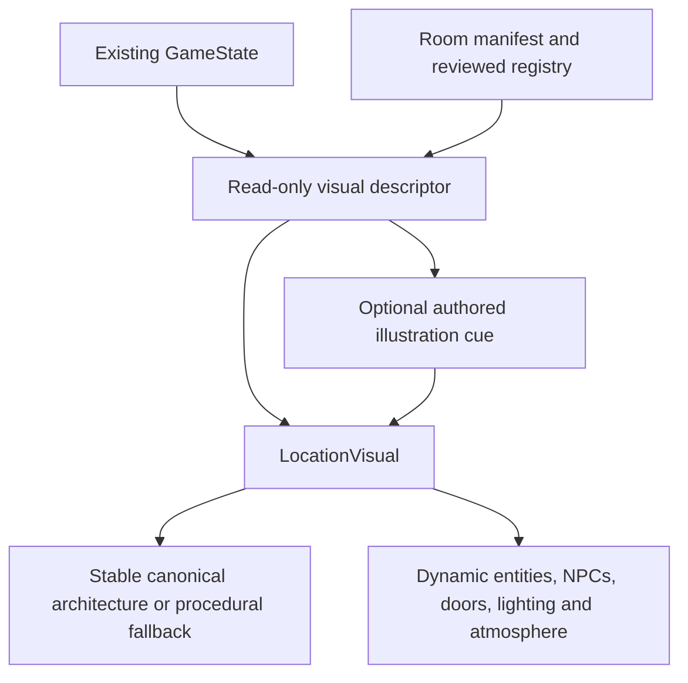

# Visual world architecture

**PRE-ALPHA / ACTIVE DEVELOPMENT.** Visual authoring v2 is isolated on `feature/state-driven-visuals`. Main and its public blind-playtest build remain preserved. Story, parser semantics, NPC writing, relationships, THE PULL and the mystery are unchanged.

## One simulation, several views

`deriveVisualState` reads the parser's actual visibility, containment, inventory and NPC-location rules. It cannot advance time, move objects, change boundaries or write saves. Images have no hotspots or action callbacks; the player continues typing commands. Text narration and the accessible **In view** list remain authoritative even with visuals Off.

## Asset roles and authority

| Role                 | Content                                               | Runtime use                                    | Authority                                                   |
| -------------------- | ----------------------------------------------------- | ---------------------------------------------- | ----------------------------------------------------------- |
| `texture`            | Empty material/lighting study                         | Behind existing object sprites                 | No architecture authority                                   |
| `canonical-room`     | Permanent architecture and explicitly fixed furniture | One stable base per room; dynamic layers above | `authoritativeArchitecture: true` only after human approval |
| `scene-illustration` | Cinematic non-explicit authored moment                | Temporary viewport replacement with caption    | `authoritativeGeometry: false`                              |
| `overlay`            | Isolated atmospheric layer study                      | Draft authoring only in v2                     | No shipping until mask and simulation binding exist         |

Role-less v1 assets retain the texture contract. Drafts are never selected. Canonical assets use the variant `canonical`; requests for independently generated early/late/dawn architecture are rejected. Asset selection gives the canonical room priority over time-specific textures. Time bands control lighting washes and existing atmospheric density, not room geometry or invented physical events.

## Permanent and dynamic facts

All 17 room manifests now distinguish `staticArchitecture`, `fixedFurniture`, `dynamicObjects`, `dynamicDoors`, `npcZones`, `atmosphereZones`, `foregroundZones`, `sceneIllustrationHints`, `requiredFacts` and `forbiddenFacts`. Permanent summaries in `architecture.ts` cite the existing spaces/affordance content through text and entity IDs. Manifests list authored dynamic details; the development generation manifest expands this into an exhaustive partition of local entities, including evidence and door counterparts. Unlisted or newly introduced entities default to dynamic, never automatically to permanent.

For Velvet Bar, the source establishes one staircase beside the salon, a view toward the small stage, a high street-facing window, the fixed counter and shelving. The example brief's red booths are not current world facts. Their absence is deliberate; no booths or new geography were added to story or parser data.

A nonportable surface such as the counter may be explicitly fixed; a closable container, stateful door, evidence, owned object or portable item cannot be classified as fixed. Loose cups, the glass, lamp, stool, bin and clock remain dynamic. The generation audit carries actual exits and full required/forbidden facts. Compact prompts are not substitutes for that review.

## Composition and fallback

A canonical candidate has no approved layout automatically. Human promotion requires a composition JSON with anchors keyed by existing entity IDs, four NPC positions and atmosphere/foreground zones in the 320 × 224 coordinate frame. It must cover existing dynamic anchors and all stateful doors; unknown entities and invalid coordinates fail validation. The reviewer must align those anchors to the selected plate, inspect entrances/exits, staircase count and fixed-furniture placement, and confirm mobile usability. The old schematic anchors are starting references, not assumed to fit new generated geometry.

Only the explicitly approved baked entity IDs lose their duplicate SVG sprites. Dynamic sprites use the reviewed layout. Unanchored entities retain their textual register. Named NPCs use actual simulation presence and reviewed placement zones. Lighting, rain, reflections, anonymous atmosphere and foreground grain remain runtime layers.

The asset records expected location/open/locked state for each baked entity. If an entity is moved, carried, hidden, destroyed, damaged or changes that state, the whole canonical plate is withheld and the renderer falls back to a compatible texture or procedural view. This avoids leaving false baked content visible before removable architecture masks exist. Image decode failure likewise restores the procedural background and original sprite anchors.

## Scene illustrations

A reviewed illustration carries an explicit binding to an existing scene ID, room, allowed time bands, required named NPCs, boundary themes and an accessible caption. Build checks validate the scene/room pairing. Runtime selection requires the matching scene, actual NPC presence and `allowed` for every listed boundary theme. A reviewer must list every depicted named character and relevant theme; software cannot infer those from pixels.

The illustration temporarily replaces the environmental image. Geometric object/NPC/weather layers are suppressed because a cinematic viewpoint may differ; actual state stays available in the caption and object list. It returns to the environmental view after six seconds or when the cue becomes ineligible, without delaying commands. Each image displays at most once per component mount, rather than replaying on every paragraph. Reloading can show it again; no seen-state is added to saves. No scene binding or illustration has been registered in this pass, so no new authored beat was inserted into the playtest.

View changes reuse the short 160 ms exposure fade. Reduced mode and reduced-motion preferences disable transitions. No click-to-advance illustration UI or input blocking is introduced.

## Performance, mobile and access

Images are ordinary reviewed static files, never model calls in the browser. Off mounts no image/SVG. Reduced removes animated atmosphere. Hidden/offscreen checks pause motion. Current-room art loads eagerly; at most one approved neighbouring environmental plate may be prefetched on eligible connections. Scene illustrations and overlay studies are excluded from neighbour/base selection.

WebP promotion preserves nearest-neighbour pixels and the 150,000-byte asset cap. Output dimensions are configurable; height is the rounded 10:7 ratio. The 512-wide preset is 512 × 358. Canonical plates and illustrations are contained rather than cropped on narrow screens. Text remains modern, legible and available independently of the images.

## Reference-guided generation

The PromptSpec includes `conditioning` (`mode`, `reference`, `mask`, `layout`) and its layer review contract. Optional `--reference` enables SDXL Turbo img2img using the existing weights. A development-only Velvet blueprint creates deterministic labelled top-down and perspective references plus an unlabelled conditioning PNG. Its routes and permanent facts are checked against the actual manifest. It fixes drawing coordinates without changing parser geography. The adapter validates hashes, current facts and exact dimensions before model loading; raw manifest conditioning cannot bypass validation. Reference copies, denoising strengths and effective steps accompany every candidate. No ControlNet dependency was added. Masks and other structural modes remain future extensions through `generate(spec, options, seed)`.

Canonical output now prefers 320 × 224 masters and exact 640 × 448 nearest-neighbour displays; 512 remains configurable. Guided promotion requires explicit approval of both the reference layout and the candidate's geometry, in addition to the existing composition review. These references never update runtime anchors automatically. See the [layout, matrix and escalation report](VISUAL-GEOMETRY-REPORT.md).

Before alternate views ship, record reference hashes/model revisions, lock the geometry source and review layout/occlusion for each view. Stateful architecture needs removable masks or layers; free text-to-image regeneration is not a controlled variant mechanism.

## Three-product production strategy

Canonical rooms now follow geometry → regional masks → surface work → lighting treatment → optional manual cleanup → pixel crunch → human review → actual runtime composite validation. `regional-inpaint` uses the cached Turbo checkpoint through the installed inpainting API. Hard masks and protected-palette restoration preserve structural pixels; semantic inventions inside editable regions still require rejection. All pre-crunch sources are retained for correction. Manual imports preserve the parent hash chain and create new unapproved drafts without claiming another model run.

Scene illustrations use an expressive, separate 64-colour preset and `authoritativeGeometry: false`; their review is about style, characters, boundaries and scene fit. They remain sparse, conditional punctuation rather than repeated room art. Dynamic overlays continue using the existing runtime descriptor and compositor. No new character sprite system, material interactions or parser behavior is implemented.

The explicit backend registry separates model capabilities from common manifest/provenance/pixel/review operations. Current registrations remain SDXL Turbo and fixtures. See [the complete asset plan](VISUAL-ASSET-PLAN.md), [bounded proofs](VISUAL-PRODUCTION-REPORT.md) and [future model criteria](VISUAL-MODEL-STRATEGY.md). No additional multi-GB checkpoint or ControlNet has been installed.

The separate future [material/property/affordance roadmap](MATERIAL-PROPERTY-AFFORDANCE-ROADMAP.md) does not change this pass's parser or simulation.
