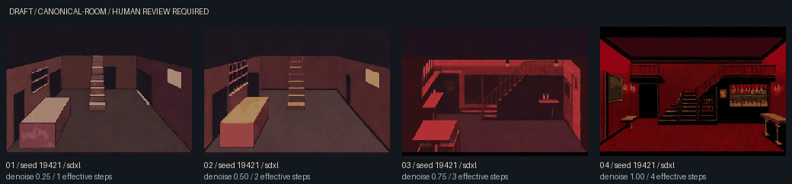
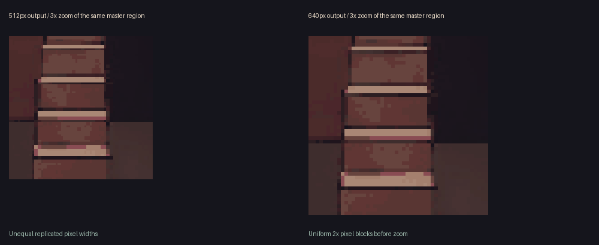

# Velvet geometry reference and img2img experiment

The fixed [top-down map](visuals/velvet-bar-layout/top-down.svg), [labelled perspective](visuals/velvet-bar-layout/perspective.png), [conditioning image](visuals/velvet-bar-layout/reference.png) and [permanent facts](visuals/velvet-bar-layout/facts.md) define one Velvet composition. They are development references pending human layout review. No generated artwork is canonical.

The world still owns geography. `src/content/visuals/layouts/bar.json` owns non-metric drawing coordinates. The rectangle, camera, heights, distances and unspecified route positions are art choices; the parser does not provide a measured floor plan. The kitchen/west, stage/east and vestibule/south relationships follow actual exit aliases. Salon is beside the one upstairs flight. The other route positions are explicitly fixed composition choices. No gameplay topology, physical door state or second floor gallery was added.

Every permanent element is documented beside the reference. All seven parser routes appear in the top-down view. The south/front wall is cut away for the perspective camera, so vestibule and outside are behind the viewer. Gold route marks denote traversal, not seven physical doors. The stage is a small distant platform at the east opening. Counter and shelves are empty. Green reservations appear only in the labelled view; the actual conditioning PNG contains no annotations, figures or movable props.

Candidate 01 from the earlier batch supplied loose compositional goals: floor visibility, depth and usable overlay space. Its image was not fed to the model and its invented geometry was not copied.

## Reproduce the controlled comparison

Activate the existing Node 22 / Python environment on this workstation with `. .\.visuals\setup\Activate.ps1`. The model remains in the existing Hugging Face cache. Build and validate the layout separately:

```sh
npm run visuals -- --room velvet-bar --role canonical-room --layout
npm run check
python -m unittest discover -s tools/visual-gen/tests -v
npm run visuals -- --room velvet-bar --role canonical-room --reference .visuals/layouts/bar/v1/layout.json --count 4 --seed 19421 --steps 4 --strengths 0.25,0.5,0.75,1 --pixel-width 320 --display-width 640 --revision 71153311d3dbb46851df1931d3ca6e939de83304 --dry-run
# Only after validating the layout and adapter:
npm run visuals -- --room velvet-bar --role canonical-room --reference .visuals/layouts/bar/v1/layout.json --count 4 --seed 19421 --steps 4 --strengths 0.25,0.5,0.75,1 --pixel-width 320 --display-width 640 --revision 71153311d3dbb46851df1931d3ca6e939de83304 --generate --device cuda --offline
```

An existing run is never overwritten. To intentionally repeat a run for reproducibility, provide a separate `--output` directory; do not change the seed to disguise a repeat.

The installed Diffusers stack supports `AutoPipelineForImage2Image` with the same SDXL Turbo weights. This adds no ControlNet model or dependency. Guidance stays zero. The official API requires `steps * strength >= 1`; our four-step matrix yields distinct effective counts. Higher **denoising strength** means **less reference retention**, not stronger structural control. The same fresh seed, prompt, reference, scheduler, crunch and display settings are used for all four images. CPU-seeded noise supplies the CUDA pipeline; inference remains on the RTX 4070. See the [official Turbo img2img documentation](https://huggingface.co/docs/diffusers/api/pipelines/stable_diffusion/sdxl_turbo).

| Candidate | Denoising | Effective steps | Intended comparison                              |
| --------- | --------- | --------------- | ------------------------------------------------ |
| 01        | 0.25      | 1               | Highest reference retention / least freedom      |
| 02        | 0.50      | 2               | Medium retention and stylization                 |
| 03        | 0.75      | 3               | Lower retention / more freedom                   |
| 04        | 1.00      | 4               | Maximum denoising / lowest structural constraint |

Simple img2img is a soft constraint. At strength 1 the denoising schedule offers minimal structural guidance; this endpoint is included to expose the failure boundary. It is not a layout guarantee. A shared seed controls noise within the same environment; it does not guarantee bit-identical results across hardware or package versions.

## Provenance and review

The adapter checks the bundle against the current manifest and blueprint, re-renders its deterministic PNG, and rejects stale facts, modified pixels or dimension changes before loading SDXL. Each batch receives its own reference copy. Metadata records reference/layout/world-fact hashes, layout version, pending layout review, conditioning mode, denoising strength, effective steps, seed strategy, actual pipeline/scheduler, pixel/display hashes and model revision. Filesystem paths in sidecars are relative to the batch.

Canonical preference is now 320 × 224 → 640 × 448 with exact 2× nearest-neighbour pixels. `--display-width 512` remains supported (512 × 358 with unequal one/two-pixel replication). Both are encoded from the same retained pixel master for size comparison, without additional diffusion.

Geometry wins over style: reject extra/moved stairs, altered room boundaries, missing/invented exits, moved counter/shelves/window, changed stage relationship or permanent clutter. Also reject painted people, evidence, movable props, door leaves with implied state, weather or event-specific lighting. Automated validation proves inputs and provenance; a human must inspect the actual output. Off-camera routes must remain consistent with the approved map.

Guided promotion additionally requires `--approve-reference-geometry`, meaning the reviewer approved the layout itself and compared the candidate to it. Original architecture, non-explicit, world-fact and actual overlay-composition reviews remain mandatory. Reference files must still match their hashes. No promotion command is part of generation.

## Escalation if geometry drifts

1. **Text-only:** useful for mood and early composition. The prior eight images established the aesthetic but varied the venue's geometry.
2. **Img2img reference:** this experiment, using existing weights and a deterministic blockout. Evaluate geometry before selecting an artistic favourite.
3. **Masked / region-guided generation:** preserve boundaries and route silhouettes, stylize bounded wall/floor/furniture regions separately. Define reviewed masks and validate edges/occlusion first.
4. **ControlNet / structural conditioning:** if regions still drift, evaluate an SDXL-compatible depth/line model with explicit GPU/cache costs, licensing, hashes and reproducibility. No such model has been installed here.
5. **Separately generated reviewed layers:** isolate fixed furniture and architectural surfaces with masks and reviewed positions. Keep dynamic simulation layers independently bound to state.

Escalation requires its own bounded experiment; this task stops after four candidates. Existing eight candidates remain unpromoted, and PR #1 remains draft.

## Results

Run **`9fd505aa2cdf`** produced exactly four real candidates, all on CUDA, in **11.66 seconds** including model loading and contact-sheet creation. The pipeline was `StableDiffusionXLImg2ImgPipeline` with `EulerAncestralDiscreteScheduler` / trailing timesteps, Torch 2.11.0+cu128, Diffusers 0.39.0 and RTX 4070. Model revision and complete per-image measurements are preserved in [comparison.json](visuals/velvet-bar-layout/comparison.json).



| Candidate | Architecture observation                                                                                                                                                                         | Quality / aesthetic / freedom                                                                            | Assessment                                                                                                                                                        |
| --------- | ------------------------------------------------------------------------------------------------------------------------------------------------------------------------------------------------ | -------------------------------------------------------------------------------------------------------- | ----------------------------------------------------------------------------------------------------------------------------------------------------------------- |
| 01 / 0.25 | Closest to reference: one central flight beside visible salon opening, left counter/shelves, right high window and east opening remain readable. Stage remains only a thin distant platform cue. | Muted burgundy, mostly flat blockout, slight worn texture; limited venue richness and little creativity. | **Study only, no approval.** Retention is encouraging, but this is not finished room art or proof of exact geometry. Human layout and overlay review remain open. |
| 02 / 0.50 | Salon opening is filled in; stage opening shrinks and platform cue disappears. Shelving gains object-like contents.                                                                              | Slightly more texture, still sparse; modest model freedom already changes important geometry.            | **Reject for geometry.**                                                                                                                                          |
| 03 / 0.75 | Stair flight rotates into an invented gallery; permanent window is lost/replaced, openings and counter change. Tables, bottles and hanging lights appear.                                        | Stronger red noir/pixel mood and more venue detail; substantial invention.                               | **Reject for geometry and baked dynamic props.**                                                                                                                  |
| 04 / 1.00 | Invented elevated galleries, altered stair configuration, counter/shelves move right and window moves left; stage/salon relationships are lost.                                                  | Most detailed crimson venue and strongest model freedom, but a different room.                           | **Reject for geometry and baked dynamic props.**                                                                                                                  |

These are assistant review findings, not human promotion attestations. Original PNGs/metadata retain draft status; a separate local `review-findings.json` records the assessments. No candidate was promoted. A single seed matrix demonstrates the trade-off, not repeatability across multiple seeds.

The lowest strength preserves the place better but largely preserves the crude reference's visual simplicity. Increasing strength recovers the previous aesthetic by changing the place. **Simple img2img has not yet achieved a finished, stable Velvet plate.** The next useful bounded experiment would be level 3: reviewed masks that keep routes, stair silhouette, counter and window fixed while adding surface character. That experiment has not been started; no extra generation or structural model download occurred.

### Display comparison

Lossless WebP encodings from the same four 320 × 224 masters:

| Candidate | 512 × 358 bytes | 640 × 448 bytes | Extra bytes for exact 2× |
| --------- | --------------: | --------------: | -----------------------: |
| 01        |          24,010 |          24,460 |                      450 |
| 02        |          23,612 |          24,176 |                      564 |
| 03        |          24,050 |          24,212 |                      162 |
| 04        |          26,246 |          26,422 |                      176 |

The exact 640 grid costs only 0.7–2.4% more here; all four remain below the existing 150,000-byte limit. Its regular pixels are preferable at native scale. Browser CSS scaling can still resample either size; the existing mobile containment remains necessary. These measurements describe this batch, not every future image. The earlier text-only V2 512 images were 25.7–36.3 KB, but they have different content, so the same-master comparison above is the fair size test.



### Local review files

Repository root on this workstation: `C:\Users\thr3e\OneDrive\Desktop\Projects\freak-city`.

- Contact sheet: `.visuals/generated/bar/review/9fd505aa2cdf/contact-sheet.webp` (100,334 bytes).
- Candidates and metadata: `.visuals/generated/bar/raw/9fd505aa2cdf/bar__canonical-room__canonical__candidate-01.png` through `-04.png`, with matching `.json` sidecars.
- Pixel masters: the same batch's `pixels/` directory, each 320 × 224.
- Exact reference and facts used: the same batch's `reference/` directory.
- 512/640 WebP comparisons: `.visuals/generated/bar/review/9fd505aa2cdf/size-comparison/`.
- Review page: `.visuals/generated/bar/review/9fd505aa2cdf/index.html`.
- Authoritative layout review: `docs/visuals/velvet-bar-layout/top-down.svg`, `top-down.png`, `perspective.png`, `reference.png`, `facts.md` and `layout.json`.

### Validation

All 998 JavaScript tests and 30 Python tests passed, including four new real-world layout tests and ten new Python reference/matrix/review tests. `npm run check` passed the production build and existing narrative, scripted parser, natural-language parser, content and embodiment checks before inference. The existing visual browser suite passed seven accessibility scans with no page errors; the role suite passed four more scans covering canonical/mobile/illustration/return/Off/fallback. Pixel/display hashes and exact 2× reproduction were verified for all four actual CUDA outputs. No story, parser, relationship or mystery content changed.

The Pages production build, visual asset validation and full formatting check also passed. The standalone local review page loaded all eleven images successfully. The original collaborator package, shipping asset registry and public assets remain unchanged.
