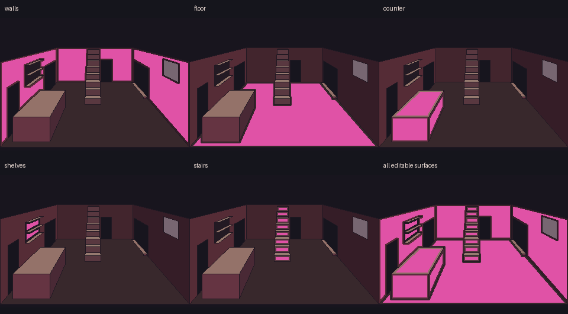
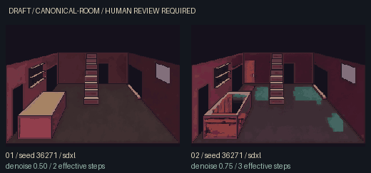
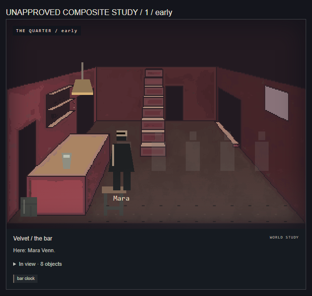
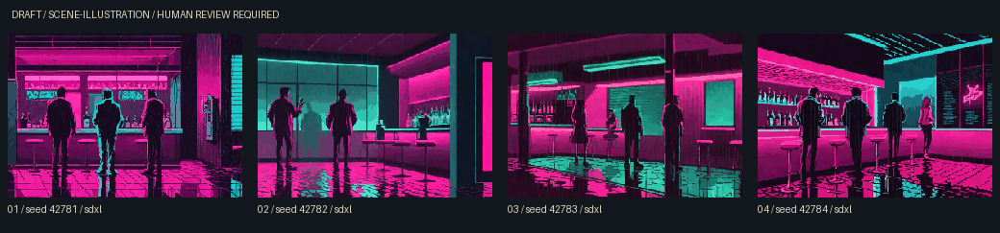

# Visual production pivot and bounded proofs

> Historical regional-mask and scene experiment. Subsequent ControlNet findings are in [the bake-off report](CONTROLNET-BAKEOFF-REPORT.md); the current external / ChatGPT hero-room direction and next task are in [WORKSTATION-HANDOFF.md](WORKSTATION-HANDOFF.md). Preserve these results; do not restart Turbo canonical batches.

Three products now guide production: **canonical gameplay rooms**, **cinematic scene illustrations**, and **dynamic simulation overlays**. Existing manifests, seeds, metadata, contact sheets, review/promotion and runtime state remain in use. See the complete [17-room asset plan](VISUAL-ASSET-PLAN.md), [art-direction families](VISUAL-STYLE.md), [model strategy](VISUAL-MODEL-STRATEGY.md) and [overlay roadmap](VISUAL-OVERLAY-ROADMAP.md).

The first production order is bar, street, office, loading bay, salon, stage and apartment (Tier A), then five supporting spaces and five simpler transitional spaces. This is a production recommendation, not measured dwell time. No new locations, scenes or gameplay content are added.

## Canonical room workflow V2

| Stage                      | Deliverable / gate                                                                                                                                                                            |
| -------------------------- | --------------------------------------------------------------------------------------------------------------------------------------------------------------------------------------------- |
| 1. Authoritative geometry  | Manifest facts, all real routes, one fixed composition and perspective blockout. Reuse Velvet layout v1; no reference pixels or prior experiments are replaced.                               |
| 2. Region definitions      | Masks derived from visible faces and occlusion. Review route/window/stair/counter/stage protection and reserved overlay floor.                                                                |
| 3. Surface beautification  | Bounded material passes in walls, floor, counter, empty shelving and stair interiors. Save the pre-crunch composite and per-region seeds/prompts.                                             |
| 4. Lighting treatment      | Neutral material response and restrained colour spill can be studied; time-specific illumination, sign states, reflections of actors and weather remain runtime layers.                       |
| 5. Optional manual cleanup | Edit a copied source in a pixel/paint tool, remove inventions or repair geometry, import as a new draft with editor/tool/notes and parent hashes.                                             |
| 6. Pixel processing        | Configurable downscale to 320, palette and contrast, exact 2× nearest-neighbour 640 display. For masked work, restore protected reference colours within the palette cap after global crunch. |
| 7. Human approval          | Inspect geometry, materials, extra features, props, fake text and boundaries. A zero protected-pixel count is not semantic approval.                                                          |
| 8. Runtime validation      | Review actual anchors, doors, NPCs and dynamic state on the plate at desktop/mobile sizes before explicit promotion.                                                                          |

The user selected the existing Velvet reference for these experiments. Its recorded status remains pending human layout review; this task does not fabricate a completed human art approval.

## Regional implementation and limits

The existing Turbo checkpoint's four-channel UNet can run through Diffusers' `StableDiffusionXLInpaintPipeline`. Its local implementation blends original unmasked latents back during denoising. We additionally composite each generated surface through a **hard binary mask**, then restore protected colours after pixel crunch. No new model weights, ControlNet, soft-edge expansion or automatic CPU fallback is involved.

Masks are built from the same ordered visible polygons as the reference, with protected contour lines and a one-master-pixel inset beyond those lines. Routes, window glass/footprint, stage view, room envelope, counter outline and stair face boundaries remain protected. Regions do not overlap. The cutaway reference does not define a ceiling surface, so a ceiling pass is intentionally unavailable; adding one would invent geometry.

Each candidate consists of five sequential surface passes. Per-region seeds are `base + 1009 * regionIndex` modulo 2³², and the two candidates share that seed set while comparing 0.50 and 0.75 denoising. Each pass sees the current composite, uses a surface-specific prompt, and cannot overwrite pixels outside its mask. The saved source and pixel master report changed protected-pixel counts separately. **A model can still draw a fake doorway or object inside a wall mask.** Human rejection remains necessary even when every protected pixel matches.

Mask metadata includes region names, file hashes, editable areas, protection policy and per-pass prompts/settings. The original source is retained under `sources/`; the 320 master under `pixels/`. Imported manual work clears the old automatic preservation claim and all approval state. It records that no new model ran during import and keeps the parent image/metadata hash chain. Nothing is promoted automatically.

## Reproduction

On this machine activate `. .\.visuals\setup\Activate.ps1`. Run the test/build checks before real inference. Existing Hugging Face cache and model revision remain unchanged.

```sh
npx tsx scripts/visual-production-plan.ts
python -m unittest discover -s tools/visual-gen/tests -v
npm run check
# Two masked canonical candidates; five surface passes per candidate:
npm run visuals -- --room velvet-bar --role canonical-room --reference .visuals/layouts/bar/v1/layout.json --regions walls,floor,counter,shelves,stairs --count 2 --steps 4 --strengths 0.5,0.75 --seed 36271 --pixel-width 320 --display-width 640 --revision 71153311d3dbb46851df1931d3ca6e939de83304 --generate --device cuda --offline
# Four expressive scene studies, no canonical geometry requirement:
npm run visuals -- --room velvet-bar --role scene-illustration --variant early --count 4 --steps 4 --seed 42781 --revision 71153311d3dbb46851df1931d3ca6e939de83304 --generate --device cuda --offline
```

The scene preset uses 320 pixels, 64 colours and contrast 1.10 to retain magenta/cyan midtones; its existing 512 display stays configurable. Canonical remains 320/48/1.15 → 640. Scene prompts prefer anonymous adult silhouettes, a distant bartender, slow-shift atmosphere, rain beyond the high window, reflective floor and cinematic framing. They explicitly carry `authoritativeGeometry: false`; detailed canonical staircase counts and overlay-composition requirements do not constrain that role. Major world/character/boundary compatibility still matters before any shipping scene binding. The proof relates to existing `floor` → `bar`, with no new story event.

To import a human-corrected source later:

```sh
python tools/visual-gen/import_edit.py --parent EXACT_DRAFT.png --edited CORRECTED_SOURCE.png --output .visuals/edited --editor PUBLIC_ALIAS --tool Aseprite --notes "Removed invented doorway; restored window outline"
```

Work on a copy of `sources/<candidate>.png` at original dimensions. The importer preserves parent files and masks and regenerates the configured pixel/display outputs as a new draft. Actual imported human corrections were tested only in temporary fixture repositories during this pass; no assistant edit is falsely attributed to a human.

## Results and review

Both proofs used the cached pinned Turbo weights on the RTX 4070, CUDA 12.8, Torch 2.11.0+cu128 and Diffusers 0.39.0. There was no additional model download, CPU fallback, promotion or all-room batch. Full measurements are in [production measurements](visuals/production-pivot/measurements.json).

### Masked canonical proof

Run **`130222c57cd7`**: two candidates, shared base seed **36271**, five regional passes each, denoising **0.50 / 0.75**, four configured steps (two / three effective steps per region). Completed in **14.425 seconds** including load and contact sheet. Peak Torch allocation was **7,946.8 MiB**; peak reserved memory **9,060 MiB**. The actual pipeline was `StableDiffusionXLInpaintPipeline`, four-channel UNet, Euler ancestral scheduler with trailing timesteps.





Both candidates have **zero changed protected pixels**, measured independently on retained 640 sources and 320 pixel masters. Both keep the single staircase outline, true openings, counter perimeter, high-window footprint and stage view intact. This is an improvement in mechanical control over whole-image img2img.

- **01 / 0.50:** preserves the simple room and adds slight surface wear, but remains visually crude. Keep as a materials/composite study, not finished canonical artwork.
- **02 / 0.75:** adds a door-like panel inside the back-wall mask and makes the counter top look like an open crate/trough. Cyan patches on the floor lack convincing reflection logic. **Reject as canonical art** despite the perfect protected-pixel score: semantic geometry can be invented inside editable surfaces.

Regional guidance solves protection of supplied silhouettes, **not the complete geometry-versus-quality problem**. Keep the mask architecture. Human material cleanup is useful now; an approved production-model comparison may improve coherent surface detail. ControlNet remains a later proposal if semantic structure still drifts—no such experiment or download was started.



The real `LocationVisual` review uses fresh isolated simulation state, actual named-NPC presence and the existing object/lighting layers. It renders both candidates plus late/dawn and mobile views. A draft placement moves the glass/stool/lamp into the new blockout composition; those coordinates are recorded in the local `runtime-composite.json` and never replace shipping anchors. The schematic overlays still look visually different from the surfaces; the [overlay roadmap](VISUAL-OVERLAY-ROADMAP.md) addresses that future art work. All test bindings are explicitly unapproved.

### Scene illustration proof

Run **`cf0d1dd767d8`**: four candidates, seeds **42781–42784**, four Turbo steps, early slow-shift bar concept. Completed in **10.254 seconds**. Peak Torch allocation was **7,946.5 MiB**, reserved **8,918 MiB**. Each sidecar explicitly records `authoritativeGeometry: false` and draft status.



The magenta/cyan contrast, black silhouettes and reflective pixel surfaces give a much stronger nightlife identity than the constrained room study. They are useful style evidence, not room maps.

| Candidate  | Style / scene review                                                                                                                                                                                                                                    |
| ---------- | ------------------------------------------------------------------------------------------------------------------------------------------------------------------------------------------------------------------------------------------------------- |
| 01 / 42781 | Strong pink counter and reflections, but three foreground figures dominate; a distant bartender is not clearly distinguished. Pseudo-lettering needs cleanup.                                                                                           |
| 02 / 42782 | Best first human-review candidate for the quieter scene: two foreground adults and a distant counter figure, with strong cyan/pink separation. The window/reflection silhouette is ambiguous; review hand shapes, extra figures and bartender identity. |
| 03 / 42783 | Strong cinematic lighting and a readable distant bartender, but more patrons than the requested small grouping; anatomy and streaks implying rain inside need review.                                                                                   |
| 04 / 42784 | Vivid nightlife with expressive reflections, but busier foreground, uncertain body details and a distracting pseudo-logo/sign. Needs cleanup and a different reviewed scene fit.                                                                        |

All visible figures are clothed and adult-presenting; none depicts explicit sexual activity. That observation does not replace human boundary/anatomy review. No named character likeness is approved. The distant bartender must not silently become Mara or any other named character without compatible authored presence. The `floor` → `bar` relationship grounds the environment; these drafts have **no approved scene binding** and their crowd/window details are not assertions about current simulation state. No illustration was promoted.

### Pixel, size and runtime measurements

| Output             | Pixel / display             | Palette                             | Lossless WebP per candidate | Contact sheet |
| ------------------ | --------------------------- | ----------------------------------- | --------------------------- | ------------- |
| Masked canonical   | 320 × 224 → exact 640 × 448 | 35 / 41 colours used, within 48 cap | 7,372 / 8,530 bytes         | 12,212 bytes  |
| Scene illustration | 320 × 224 → 512 × 358       | 64 colours                          | 29,418–38,634 bytes         | 83,774 bytes  |

All optimized drafts are below the 150,000-byte cap. The canonical outputs keep exact 2× pixels; scene display width is still configurable, including 640. The earlier same-master comparison already established only a 0.7–2.4% size penalty for 640; it was not repeated with another diffusion batch. Original sources, pixel masters and display hashes were verified for all six new real images. Peak reserved memory is a Torch allocator measurement, not total machine GPU use.

These review images add **zero shipping asset bytes**. The normal visual browser suite measured approximately **10 ms median parser command latency**, seven accessibility scans and no page errors. The role suite passed four more accessibility scans and canonical/mobile/illustration/return/Off/fallback checks. The current stylization therefore adds authoring cost, not runtime inference.

### Validation and review locations

Before inference, `npm run check` passed **1,000 JavaScript tests**, the normal production build, and existing narrative/parser/content/embodiment checks. **37 Python tests** passed, covering legacy modes plus regional masks, exact protection/palette limits, deterministic region seeds, model call binding, backend registration, edit provenance and cross-encoder reference validation. The new review tool produced two actual runtime composites, late/dawn and mobile snapshots without registry writes. Final Pages/format and GitHub checks are verified before delivery.

Under `C:\Users\thr3e\OneDrive\Desktop\Projects\freak-city`:

- Canonical review page and contact: `.visuals/generated/bar/review/130222c57cd7/index.html` and `contact-sheet.webp`.
- Canonical candidates, sidecars, masks, references, sources and masters: `.visuals/generated/bar/raw/130222c57cd7/`.
- Scene review page and contact: `.visuals/generated/bar/review/cf0d1dd767d8/index.html` and `contact-sheet.webp`.
- Scene candidates, sidecars, sources and masters: `.visuals/generated/bar/raw/cf0d1dd767d8/`.
- WebP measurements: each review directory's `optimized/` folder; compact cross-batch metrics also live in this report's committed JSON.

**Human-review next:** inspect the mask exclusions and canonical 01 together with its actual runtime composite; review scene 02 for mood, anonymous figures, bartender interpretation and cleanup. Neither is a promotion recommendation yet. Decide on the acceptable hand-finished material direction before requesting a specific production checkpoint download. The suggested production backend is a standard SDXL-family/inpainting comparison, not an automatic Turbo replacement.

## Previous evidence and CI repair

The original texture batch `49ad3f1999c7`, text-only canonical batch `54fd0e217eac` and img2img matrix `9fd505aa2cdf` remain preserved and unpromoted. No generated candidate has entered `public/` or the asset registry. PR #1 stays draft, main and its Pages deployment stay unchanged.

The previous Linux GitHub check exposed a test that compared compressed PNG bytes across encoders. Reference validation now compares decoded RGB geometry while separately verifying each file against its own provenance hash. Alternate lossless encodings are accepted; a changed pixel is still rejected even if somebody updates the file hash. The historical reference and batch bytes are preserved.
