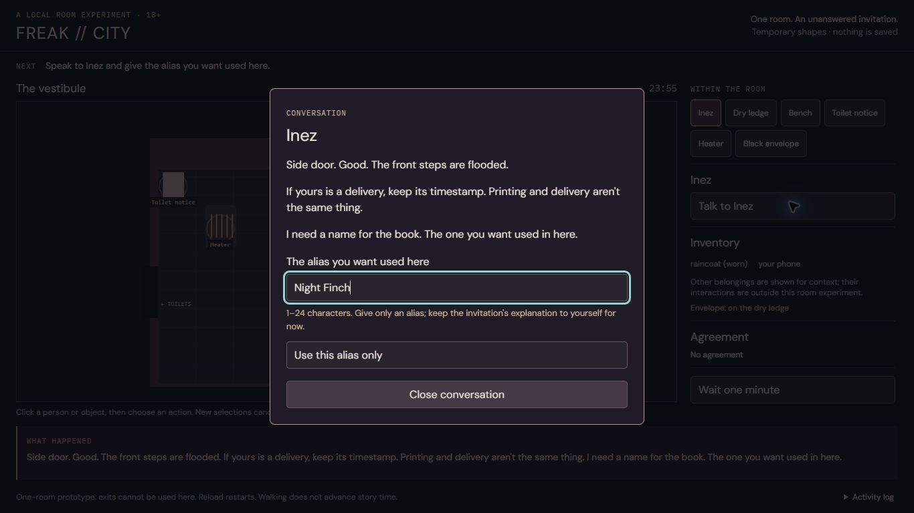
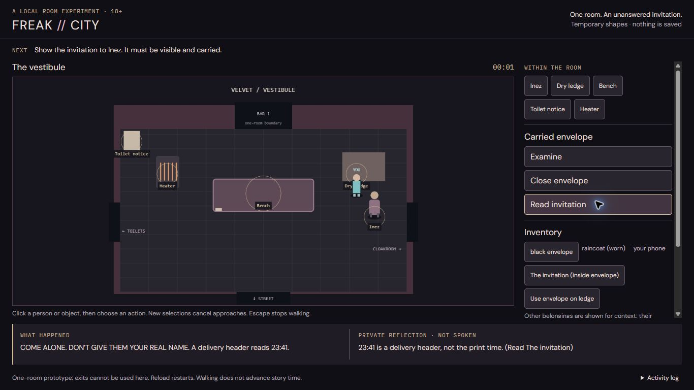
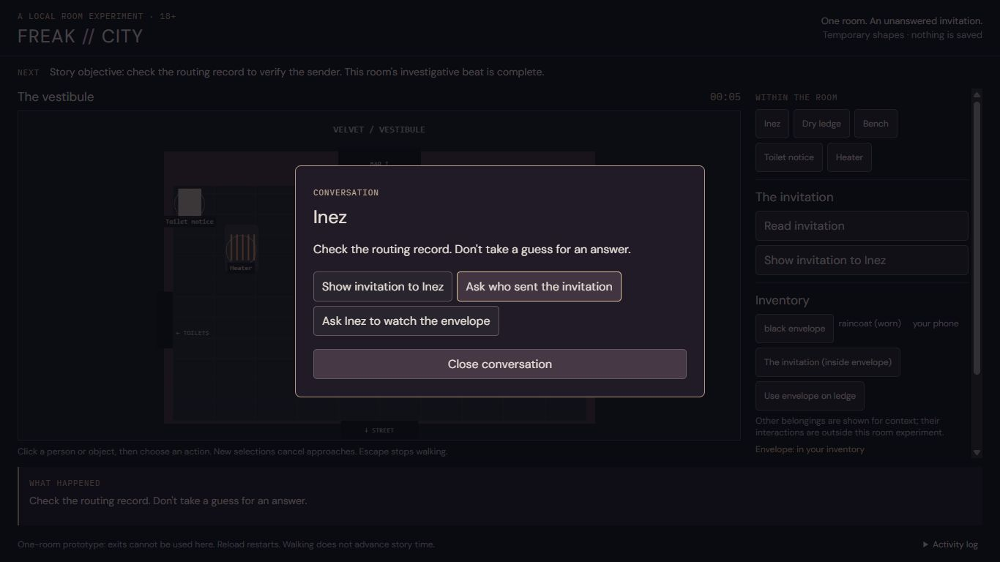
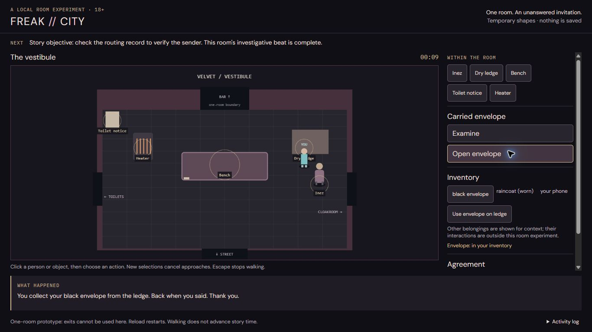

# Conversational and investigative beat

Local, uncommitted milestone, 2026-09-15. The bounded beat is complete and was played through visible Chrome at `http://127.0.0.1:5174/__prototype/` using pointer clicks and typed input. This was informed exploratory testing, not a blind human playtest. Automated browser checks are reported separately below.

## Result and scope

The player can answer Inez with an alias, open and read the invitation, show it to her, and ask who sent it. Her existing response supplies the next story objective: check the routing record. The interface explicitly says exits cannot be used in this one-room prototype. No new sender, culprit, motive, schedule, relationship, room or NPC speech was authored.

### Files changed for this milestone

| File                                                                     | Change                                                                                                                                 |
| ------------------------------------------------------------------------ | -------------------------------------------------------------------------------------------------------------------------------------- |
| `src/engine/parser.ts`                                                   | Narrow typed alias entry through the existing complete transaction; repeat Inez greeting respects the completed introduction.          |
| `prototype/simulation.ts`                                                | Explicit alias, container, reading and evidence mappings; visibility/custody/knowledge checks; objective projection.                   |
| `prototype/targeting.ts` (new), `prototype/room.ts`                      | Visible-shape hit regions, foreground overlap priority, consistent cancellation and arrival feedback.                                  |
| `prototype/main.ts`, `prototype/style.css`                               | Alias form, evidence controls, persistent latest response, private reflection, explained belongings, correct dialogue Escape.          |
| `tests/alias-introduction.test.ts` (new)                                 | Alias normalization, command-like data, context, pending agreement protection, transaction parity and repeat introduction regressions. |
| `prototype/beat.test.ts` (new)                                           | Beat parity, container/custody/knowledge gates, private reflection isolation, safekeeping and shape regressions.                       |
| `prototype/beat-browser-check.ts` (new), `prototype/package.json`        | Current isolated browser regression entry point. Original browser script retained as historical coverage.                              |
| `prototype/README.md`, this report, `prototype/evidence/beat-milestone/` | Current instructions and fresh evidence, separate from retained results.                                                               |

## Confirmed defects reproduced before changes

These were reproduced through the visible browser before editing. Coordinates depend on viewport; use the named visible feature to reproduce.

| Steps                                                                                                                      | Observed before                                                                                                                             | Expected and verified after                                                                                          |
| -------------------------------------------------------------------------------------------------------------------------- | ------------------------------------------------------------------------------------------------------------------------------------------- | -------------------------------------------------------------------------------------------------------------------- |
| Click Inez's visible head, then torso. Click the bench's far left edge and heater's upper edge.                            | Inez's upper body did not select her; the bench edge produced unreachable-floor feedback. Small circular hit regions missed visible shapes. | Character and furniture shapes select their corresponding targets. Envelope wins its visible overlap with the ledge. |
| Carry the envelope, walk away from the ledge, choose Use envelope on ledge, then immediately click the inventory envelope. | Selection changed, but the queued placement still executed on arrival.                                                                      | Selection stops movement and clears the pending callback; the envelope remains carried.                              |
| Queue a bench action, then select Heater.                                                                                  | Stale Walking to Bench feedback remained after changing intention.                                                                          | Feedback describes the current selection; the old action cannot execute.                                             |
| Open an Inez conversation, then press Escape.                                                                              | Conversation closure reported Walking cancelled.                                                                                            | It reports Conversation closed. Escape reports Walking cancelled only for actual movement.                           |
| At 1366×768, perform an action and look for its result.                                                                    | Latest feedback was below the viewport: measured top 853, bottom 919.                                                                       | Latest response is in the main layout, measured top 638, bottom 718, with page scroll at zero.                       |
| Talk to Inez and try to answer her request for a name.                                                                     | Dialogue had a close control but no way to answer.                                                                                          | Labelled alias input accepts keyboard submission and uses established rules.                                         |
| Take the envelope and inspect its available actions.                                                                       | Only Examine; no graphical opening/reading sequence.                                                                                        | Open/close and visible invitation reading are available through the engine.                                          |
| Select Heater and choose Private thought.                                                                                  | Envelope-specific commentary irrespective of the selected subject.                                                                          | Misleading general button removed. First invitation reading triggers existing relevant private evidence commentary.  |
| Inspect coat and phone inventory controls.                                                                                 | Disabled controls gave no explanation.                                                                                                      | Belongings are plain contextual text with an explicit scope explanation.                                             |

The pre-fix UI established the failures; subsequent source inspection identified small hit circles, inconsistent selection cancellation, below-room log placement and envelope-bound commentary as their causes. Placeholder art is not the cause of these interaction failures.

## Authored-content audit and transaction boundary

- `src/content/scenes/opening.ts` already contains the alias-only introduction choice and Inez's response about refusing a full-name request. The typed form chooses that existing reply with its existing timing and consequences.
- Alias normalization matches the existing setup in `src/App.tsx`: trim, remove angle brackets/control characters and limit to 24 characters; empty aliases fail. Typed text is a separate argument to `executeAliasIntroduction`, never interpolated into a parser command or split into commands.
- The alias entry shares the complete transaction used by `executeCommand`: cloned state, rollback, commitments, timing, observations, transcript and existing validation remain in effect. The adapter does not assign narrative state. Pending questions/offers and inappropriate introduction contexts are rejected.
- `src/content/world.ts` already supplies the invitation and header. Reading through the existing engine grants knowledge with its provenance. Opening, visibility, custody and nested inventory are preserved.
- Existing invitation presentation grants Inez evidence knowledge and a memory while retaining player custody. Its existing acknowledgement is brief: “All right. I can see it.”
- The engine's existing unknown-sender response is: “Check the routing record. Don't take a guess for an answer.” The objective panel derives the completed beat from that response. It does not claim that an exit is traversable.
- A repeat greeting uses existing generic Inez wording and does not restart the introduction or accidentally begin the later service-corridor exchange. General free-form conversation remains out of scope.
- First successful invitation reading invokes the existing private `think about invitation` transaction. The existing header/provenance commentary is labelled PRIVATE REFLECTION · NOT SPOKEN. Focused tests verify no NPC knowledge/social changes or narrative time cost. It runs once per fixture's first reading, not as random commentary.

**Authorial decision:** none is required to complete this bounded beat. A richer evidence acknowledgement could be a later writing decision; this implementation preserves the existing short response. Resolving the sender or implementing the routing-record investigation is beyond this room.

## Actual visible Chrome playthrough

Fresh regular Chrome task tab, no Incognito and no personal save access. Local fixture only. Actions below used real pointer and keyboard interaction; no engine calls or state injection were used to play.

1. Clicked Inez's head and torso, the bench's left edge and the heater's upper edge: each selected the visible subject. Walked through the room.
2. Selected Inez and Talk. Typed **Night Finch** into the alias form and pressed Enter.
   - Inez: “If somebody asks for your full name, you can say no. If they say I need it, they are wrong.”
3. Pressed Escape: **Conversation closed.** Talked again: “I'm listening. What did you want to say about it?” No repeated alias request.
4. Took the black envelope (23:59), opened it (00:00), and read the invitation (00:01).
   - “COME ALONE. DON'T GIVE THEM YOUR REAL NAME.” Delivery header: **23:41**.
   - Separate private reflection: “23:41 is a delivery header, not the print time. (Read The invitation)”
5. Selected the nested invitation in Inventory and showed it to Inez.
   - Inez: “All right. I can see it.”
6. Asked who sent it (00:05).
   - Inez: “Check the routing record. Don't take a guess for an answer.”
   - Visible next objective: check the routing record; room beat complete. Footer still explains exits cannot be used.
7. Closed the envelope (00:06), walked to the far side of the room, queued placement on the ledge, and immediately selected the inventory envelope. The protagonist stopped; the envelope stayed carried after the approach would have completed.
8. Asked Inez to watch the closed envelope. Read her existing closed-envelope, dry-ledge and 00:15 terms; accepted (00:08). UI showed envelope on ledge and active agreement.
9. Closed the conversation with Escape, selected and collected the envelope (00:09).
   - “You collect your black envelope from the ledge. Back when you said. Thank you.”
   - UI showed inventory custody and **fulfilled** agreement.

All these steps used the 1366×768 viewport. Latest response and current objective remained visible without scrolling the page or opening the activity log. The sidebar has its own scroll area when its controls exceed available height. Temporary viewport override was reset afterwards.

### Visible-play screenshots

## Fresh verification

| Check                                  | Fresh result                                                                                                                                                                                                                                                                    |
| -------------------------------------- | ------------------------------------------------------------------------------------------------------------------------------------------------------------------------------------------------------------------------------------------------------------------------------- |
| `npm run check --prefix prototype`     | TypeScript check and **28 tests passed**: 11 retained test cases rerun plus 17 new cases.                                                                                                                                                                                       |
| `npm run test:beat --prefix prototype` | New headless browser regression passed: alias, repeated conversation, reading/showing, target edges, cancellation, Escape, laptop/mobile layout, safekeeping and storage isolation. Zero page errors and zero desktop axe violations.                                           |
| Root `npm run check`                   | Passed in a temporary source copy: build, **1,107 tests across 13 files**, narrative QA, deterministic/fuzz campaigns, export, 12 parser campaigns, 60 natural-language campaigns and 117-scene embodiment audit. Existing nonfatal motel conditional-exit review flag remains. |
| Root `npm run test:browser`            | Passed from temporary verification copy: **11 accessibility scans**, desktop/mobile, keyboard, drafts, IME, narrow layouts, panels and reload.                                                                                                                                  |
| Root `npm run format:check`            | Passed in verification copy. Modified prototype files checked separately because the root formatting gate excludes the prototype.                                                                                                                                               |
| Visible browser                        | Complete beat plus repeat conversation, natural shape clicks, cancelled placement and witnessed safekeeping collection passed as recorded above.                                                                                                                                |

Root gates ran in a temporary copy to keep generated build/export artifacts out of the working tree. Dependencies were reused locally; no dependency or lockfile changes were needed. Environment was Node **24.14.0**, npm **11.9.0**; recommended Node 22 was not separately tested.

The browser regression used an isolated automated context with synthetic autosave/bookmark/draft values. It recorded **zero storage API calls**, unchanged synthetic values, and fixture reset on reload. These are test values, not personal saves. The actual Chrome playthrough did not inspect storage. Existing historical evidence was retained; `browser-results.json`, root gate logs and these `visible-*` screenshots are fresh for this milestone.

## Remaining limits and preserved work

- The routing record is a story objective beyond the prototype boundary. No exits or additional rooms are implemented.
- Conversation remains authored and bounded; only aliases accept typed text. The evidence acknowledgement remains terse.
- Art and animation remain placeholders. There are no new art assets or art activation changes.
- The latest response no longer requires page scrolling; a crowded sidebar may require its own scrolling. This is a remaining presentation tradeoff, not a hidden-response defect.
- No persistence/save migration, runtime generation, publishing, commits or pushes. Existing holds remain in effect.
- A before-edit checkpoint and SHA-256 manifest were retained outside the repository. `preservation.json` records the final comparison of all 905 baseline source/assets files; only the seven intended pre-existing implementation/instruction files changed. New tests, targeting helper and milestone evidence are additions.

Next bounded milestone: develop and review richer authored responses to evidence before expanding beyond the room. The present source already supports a coherent, playable introduction and investigative handoff.
